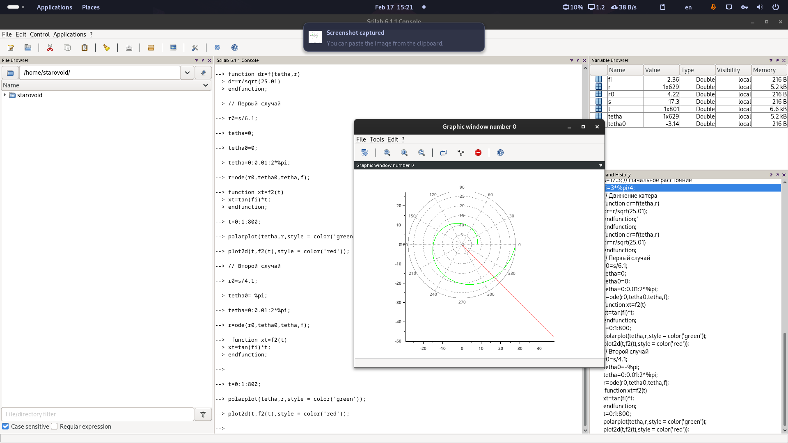

---
## Front matter
lang: ru-RU
title: Презентация лабораторной работы №2
subtitle: Работа с Git
author:
  - Старовойтов Е. С.
institute:
  - Российский университет дружбы народов, Москва, Россия

date: 17 февраля 2024

## i18n babel
babel-lang: russian
babel-otherlangs: english

## Formatting pdf
toc: false
toc-title: Содержание
slide_level: 2
aspectratio: 169
section-titles: true
theme: metropolis
header-includes:
 - '\makeatletter'
 - '\makeatother'
---

# Информация

## Докладчик
  * Старовойтов Егор Сергеевич
  * студент
  * Российский университет дружбы народов

# Вводная часть
На море в тумане катер береговой охраны преследует лодку браконьеров.
Через определенный промежуток времени туман рассеивается, и лодка
обнаруживается на расстоянии 17,3 км от катера. Затем лодка снова скрывается в
тумане и уходит прямолинейно в неизвестном направлении. Известно, что скорость
катера в 5,1 раза больше скорости браконьерской лодки.

## Актуальность
- Это классическая задача

## Объект и предмет исследования
- Задача о погоне

## Цели и задачи
- Повторить знания по работе с git
- Создать отчет и презентацию в Markdown

# Цель работы
Решить путем математического моделирования задачу о погоне.

# Задание
1. Провести аналогичные образцовым рассуждения и вывод дифференциальных уравнений,
если скорость катера больше скорости лодки в n раз (значение n задайте
самостоятельно). В моем варианте под номером №51 `n = 5.1`.
2. Построить траекторию движения катера и лодки для двух случаев. (Задайте
самостоятельно начальные значения).

# Выполнение лабораторной работы
Я вывел уравнение: `dr/dtheta = r/sqrt(25.01)`, откуда `dr = r/sqrt(25.01)`.

На скриншотах ниже продемонстрирован набор команд в консоли Scilab для первого и второго случая задачи.

## Первый случай
{#fig:001 width=70%}

{#fig:002 width=70%}

Примерная точка пересечения катера с лодкой - (6, -6).

## Второй случай
{#fig:003 width=70%}

{#fig:004 width=70%}

Примерная точка пересечения катера с лодкой - (18, -16).

# Выводы
Путем математического моделирования в Scilab решена задача о погоне.
