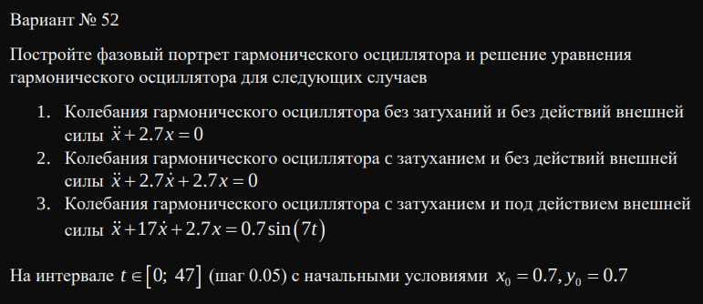
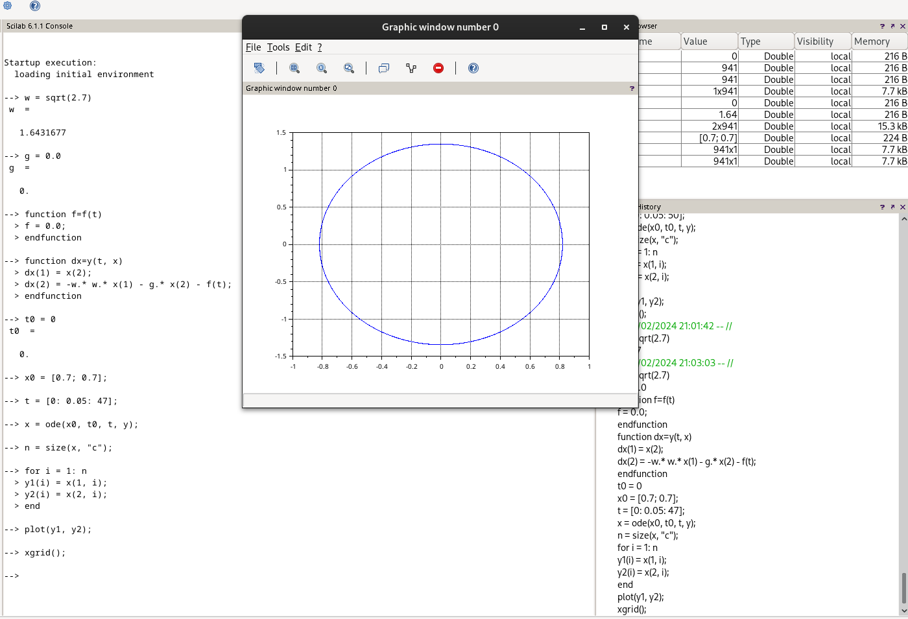
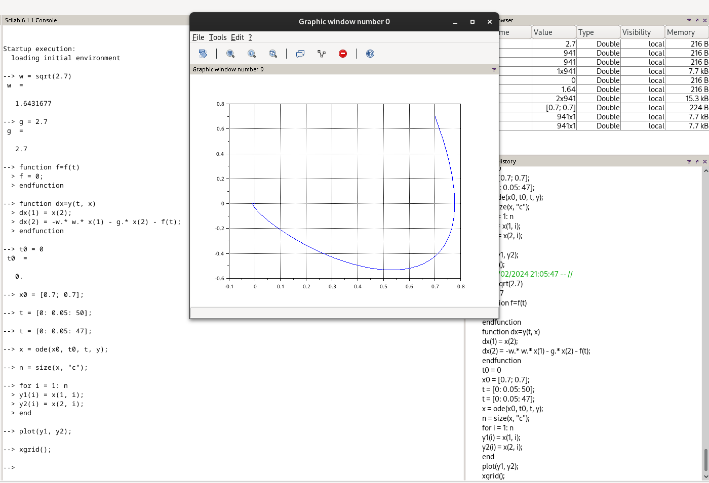
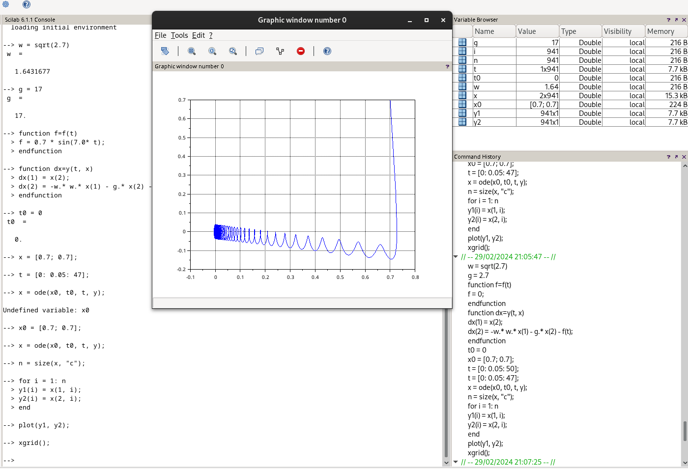

---
## Front matter
lang: ru-RU
title: Презентация лабораторной работы №4
subtitle: Модель гармонических колебаний
author:
  - Старовойтов Е. С.
institute:
  - Российский университет дружбы народов, Москва, Россия

date: 20 февраля 2024

## i18n babel
babel-lang: russian
babel-otherlangs: english

## Formatting pdf
toc: false
toc-title: Содержание
slide_level: 2
aspectratio: 169
section-titles: true
theme: metropolis
header-includes:
 - '\makeatletter'
 - '\makeatother'
---

# Информация

## Докладчик
  * Старовойтов Егор Сергеевич
  * студент
  * Российский университет дружбы народов

# Цель работы
Изучить модель "линейный гармонический осциллятор".

# Задание

# Выполнение лабораторной работы
## Первый случай
{#fig:001 width=70%}

## Второй случай
{#fig:001 width=70%}

## Третий случай
{#fig:001 width=70%}

# Выводы
Я изучил основные принципы работы с моделью линейного гармонического осциллятора.